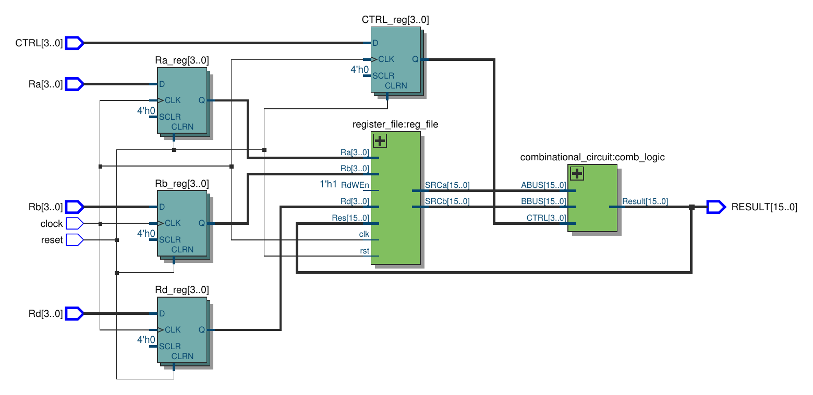

<!-- _class: title -->

# Cipher-16

## A 16-bit Cryptographic Coprocessor in VHDL

<div class="meta">

CSE 226: Hardware Design &nbsp;·&nbsp; Zagazig University

Mohamed Emad ElSawy &nbsp;·&nbsp; Mohamed Mahmoud Ramadan &nbsp;·&nbsp; Mohamed Ali Mohamed
Mohamed Magdy Hendawy &nbsp;·&nbsp; Mohamed Mustafa ElSayed

</div>

---

# What is Cipher-16?

A small **hardware accelerator** for the operations that sit inside block ciphers.

The CPU offloads the inner loop to dedicated logic, then reads the result back.

<div class="two-col">

<div>

**The four primitives**
<span class="pill">Substitute</span> S-Boxes
<span class="pill">Compute</span> ALU
<span class="pill">Rotate</span> Shifter
<span class="pill">Store</span> 16-register file

</div>

<div>

**Interface**
4-bit opcode `CTRL`
3 register indices `Ra`, `Rb`, `Rd`
16-bit `RESULT` bus

</div>

</div>

The whole device is one entity (`coprocessor`) you drop into a larger design.

---

<!-- _class: section-title -->

# 1. Architecture

---

# Two cooperating blocks

<div class="two-col">

<div>

## Datapath
- Input pipeline register stages `Ra/Rb/Rd/CTRL`
- 16 × 16-bit **register file**
  - Combinational reads on `A_BUS`, `B_BUS`
  - Synchronous write to `R[Rd]`
- Async, active-high reset

</div>

<div>

## Combinational block
- **LUT** (two 4-bit S-Boxes on `A_BUS[7:0]`)
- **ALU** (arith/logic on `A_BUS`, `B_BUS`)
- **Shifter** (rotations / shifts on `B_BUS`)
- Per-bit MUX driven by a tiny CTRL decoder

</div>

</div>

```
clk/rst  ──►  input_reg  ──►  reg_file  ──►  comb_logic  ──►  RESULT
                                  ▲                              │
                                  └──────── write-back ◄─────────┘
```

---

# Top-level schematic


---

# CTRL: one opcode, three paths

| CTRL[3] | CTRL[1:0] | Selected unit               |
| :-----: | :-------: | :-------------------------- |
|   `0`   |    any    | Non-linear lookup (S-Boxes) |
|   `1`   |   `11`    | Shifter                     |
|   `1`   |   other   | ALU                         |

One nibble picks both **which unit runs** and **which operation it performs**.

The ALU and the Shifter further decode `CTRL[3:0]` internally.

---

# Pipeline timing

```
edge N    : input_reg captures Ra/Rb/Rd/CTRL
            reg_file writes the previous RESULT to R[Rd_prev]
            comb_logic settles → RESULT is the new instruction
edge N+1  : reg_file writes that RESULT to R[Rd]
```

- An instruction's **RESULT is visible during** its own cycle.
- Its **write-back happens on the next clock edge**.
- Reading the register you just wrote returns the value committed one cycle ago.

---

<!-- _class: section-title -->

# 2. Components

---

# Register File &nbsp;<span class="pill">16 × 16</span>

```vhdl
process (clk, rst) begin
  if rst = '1' then
    registers <= (others => (others => '0'));
  elsif rising_edge(clk) then
    if RdWEn = '1' then
      registers(to_integer(unsigned(Rd))) <= Res;
    end if;
  end if;
end process;

SRCa <= registers(to_integer(unsigned(Ra)));
SRCb <= registers(to_integer(unsigned(Rb)));
```

- Two **combinational read ports** (`SRCa`, `SRCb`).
- One **synchronous write port** gated by `RdWEn`.
- **Async reset** zeroes every entry the instant `rst` rises.

---

# Non-Linear Lookup &nbsp;<span class="pill">S-Box 1 &amp; S-Box 2</span>

`LUTIN[7:0]` splits into two 4-bit nibbles, each fed to its own substitution table; the outputs concatenate to `LUTOUT[7:0]`.

<div class="two-col">

<div>

**Low nibble -> S-Box 1**

|  In   |  Out  |  In   |  Out  |
| :---: | :---: | :---: | :---: |
|   0   |   1   |   8   |   E   |
|   1   |   B   |   9   |   8   |
|   2   |   9   |   A   |   7   |
|   3   |   C   |   B   |   4   |
|   4   |   D   |   C   |   A   |
|   5   |   6   |   D   |   2   |
|   6   |   F   |   E   |   5   |
|   7   |   3   |   F   |   0   |

</div>

---

<div>

**High nibble -> S-Box 2**

|  In   |  Out  |  In   |  Out  |
| :---: | :---: | :---: | :---: |
|   0   |   F   |   8   |   9   |
|   1   |   0   |   9   |   2   |
|   2   |   D   |   A   |   C   |
|   3   |   7   |   B   |   1   |
|   4   |   B   |   C   |   3   |
|   5   |   E   |   D   |   4   |
|   6   |   5   |   E   |   8   |
|   7   |   A   |   F   |   6   |

</div>

</div>

Sanity check: `LUTIN = 0x00 → 0xF1` &nbsp;·&nbsp; `LUTIN = 0xF1 → 0x6B`

---

# Shifter &nbsp;<span class="pill">3 valid opcodes</span>

```vhdl
with CTRL select SHIFT_OUT <=
  B_BUS(7 downto 0)  & B_BUS(15 downto 8) when "1000",   -- ROR8
  B_BUS(3 downto 0)  & B_BUS(15 downto 4) when "1001",   -- ROR4
  B_BUS(7 downto 0)  & x"00"              when "1010",   -- SLL8
  x"0000"                                 when others;
```

|  CTRL  | Operation                      | Example on 0xDEAD |
| :----: | :----------------------------- | :---------------: |
| `1000` | ROR8 (rotate right 8)          |     `0xADDE`      |
| `1001` | ROR4 (rotate right 4)          |     `0xDDEA`      |
| `1010` | SLL8 (left shift 8, zero-fill) |     `0xAD00`      |
| other  | drive `0x0000`                 |     `0x0000`      |

Pure combinational; no clock, no state.

---

# ALU

Arithmetic and logical unit on `ABUS`, `BBUS`, selected by `ALUsel = CTRL`.

- Receives the **same `CTRL` nibble** the top-level decoder uses to route to it.
- Returns `0x0000` for opcode values it does not decode.
- Designed as a **plug-in computational unit**: the rest of the coprocessor does not depend on its internal opcode set.

In the verification suite the ALU path is reached for `CTRL ∈ {1000, 1001, 1010}` (i.e. `CTRL[3]='1'` and `CTRL[1:0] ≠ "11"`).

---

# Combinational Block &nbsp;<span class="pill">CTRL decoder + MUX</span>

```vhdl
control_logic: process(CTRL, lut_out, alu_out, sh_out) begin
  case CTRL(3) is
    when '0'   => RESULT <= lut_out;            -- LUT path
    when others =>
      case CTRL(1 downto 0) is
        when "11"   => RESULT <= sh_out;        -- Shifter path
        when others => RESULT <= alu_out;       -- ALU path
      end case;
  end case;
end process;
```

The three functional units run **in parallel** every cycle.
The decoder picks which one drives `RESULT`; the other two outputs are discarded.

---

# Top-level Coprocessor

```vhdl
entity coprocessor is
  port (
    clock  : in  std_logic;
    reset  : in  std_logic;
    CTRL   : in  std_logic_vector(3 downto 0);
    Ra,Rb,Rd : in std_logic_vector(3 downto 0);
    RESULT : out std_logic_vector(15 downto 0)
  );
end coprocessor;
```

Three things happen inside:
1. **`input_reg`** stages the opcode and register indices.
2. **`reg_file`** writes back the previous `RESULT` and exposes the new operands.
3. **`comb_logic`** drives `RESULT` from the unit `CTRL` selects.

---

<!-- _class: section-title -->

# 3. Verification

---

# Self-checking testbench

`tb/coprocessor_tb.vhd` runs a fixed instruction sequence and **asserts** the expected `RESULT` after every clock tick (sampled a quarter-period after the rising edge so the combinational path is settled).

| Step             |  CTRL  |  Ra   |  Rd   |  Path   | Expected RESULT |
| :--------------- | :----: | :---: | :---: | :-----: | :-------------: |
| Reset            | `0000` |   0   |   0   |   LUT   |    `0x00F1`     |
| LUT read         | `0000` |   5   |  10   |   LUT   |    `0x00F1`     |
| Write-back probe | `0000` |  10   |   9   |   LUT   |    `0x006B`     |
| ALU (`1000`)     | `1000` |  10   |   8   |   ALU   |    `0x0000`     |
| ALU (`1001`)     | `1001` |  10   |   7   |   ALU   |    `0x0000`     |
| Shifter (`1011`) | `1011` |  10   |   6   | Shifter |    `0x0000`     |

Final report: **`All coprocessor tests PASSED`**.

---

# How `0x006B` proves write-back works

```
cycle 1 (reset):  R[*] = 0  ;  LUT(0x0000) = 0x00F1
                            ▼ next edge writes 0x00F1 → R[0]
cycle 2 (LUT):    Ra=5, R[5]=0, RESULT = 0x00F1
                            ▼ next edge writes 0x00F1 → R[10]
cycle 3 (probe):  Ra=10, R[10] = 0x00F1
                  LUT(0x00F1) = sbox2(F)·sbox1(1) = 0x6·0xB = 0x6B
                  → RESULT = 0x006B   ✓
```

Observing `0x006B` is **only possible if the previous-cycle write actually committed** `0x00F1` into `R[10]`. One value verifies the whole pipeline.

---

# Toolchain

<div class="two-col">

<div>

## Build &amp; simulate
- **GHDL** — VHDL elaboration &amp; simulation
- **GTKWave** — waveform viewer
- **Make** — drives the flow

```
make           # compile + run all TBs
make coprocessor
make simu      # open .vcd in GTKWave
```

</div>

<div>

## Schematic
- **Active-HDL** — RTL schematic export
- One PDF per entity (Top-view, CLU,
  Register, ALU, Shifter, LUT)

## Sources
- `src/` — RTL
- `tb/`  — testbenches
- `simu/` — generated VCDs

</div>

</div>

---

<!-- _class: section-title -->

# Thank you

---

<!-- _class: title -->

# Questions?

<div class="meta">

repo: github.com/hulxv/cipher-16


</div>
